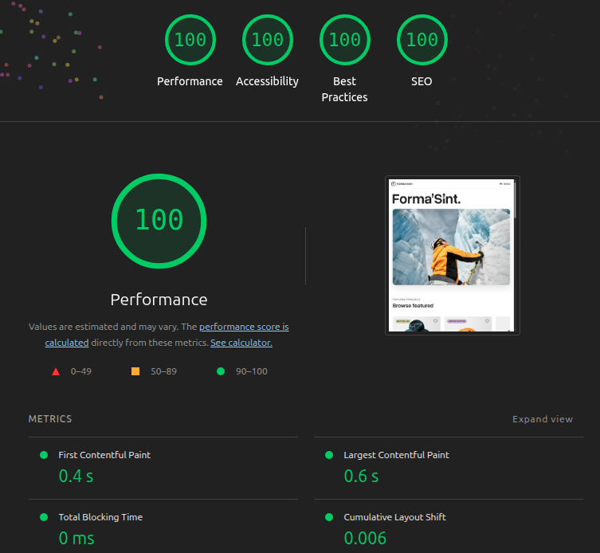
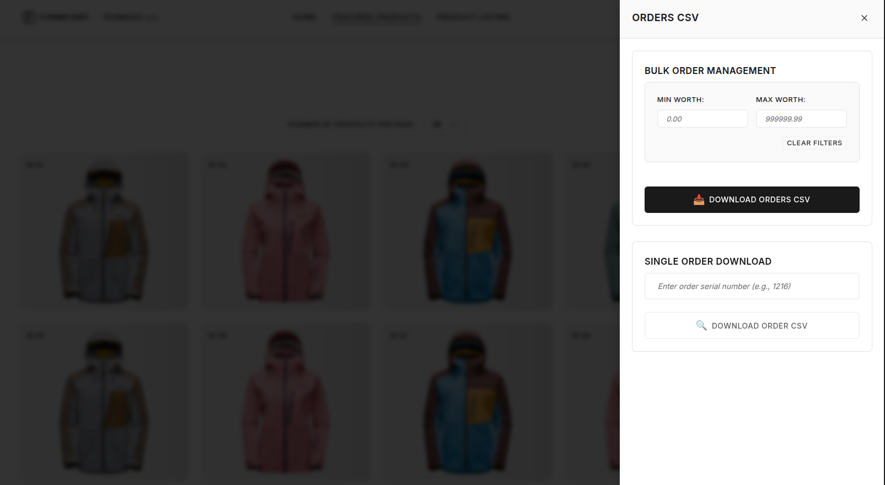

# Forma'Sint - Premium Outdoor Gear

- **Full-Stack Application**: [https://fullstack.bieda.it/](https://fullstack.bieda.it/)

A modern, responsive e-commerce platform for outdoor gear and climbing equipment with both frontend and backend components.
Note: please note that the GIF below illustrates only the front-end portion.


## Performance



## Architecture

### Frontend (`/frontend`)
Modern, responsive client-side application featuring:
- 🎯 Responsive design across all devices
- 🔍 SEO optimized
- 🎨 Vanilla HTML/CSS/JavaScript
- 📱 Mobile-first approach

### Backend (`/app`)
RESTful API server with order management system featuring:
- 🗄️ MongoDB database integration
- 📦 Order processing and management
- 🔒 Security middleware
- 📊 External API integrations
- 🕐 Order scheduling services



## Quick Start

### Frontend Development
```bash
cd frontend
# Open index.html in your browser - no build process required
```

### Full-Stack Development
```bash
# Start both frontend and backend with Docker Compose
docker compose up

# Start with watch mode for automatic rebuilds on file changes
docker compose watch

# Start in background
docker compose up -d
```

### Backend Development
```bash
cd app
npm install         # Install dependencies
npm test            # Run tests
npm run lint        # Check code quality
```

## Tech Stack

### Frontend
- Vanilla HTML/CSS/JavaScript
- Swiper.js for carousels
- Playwright for testing
- ESLint for code quality

### Backend
- Node.js with Express.js
- MongoDB database
- Docker containerization
- RESTful API architecture
